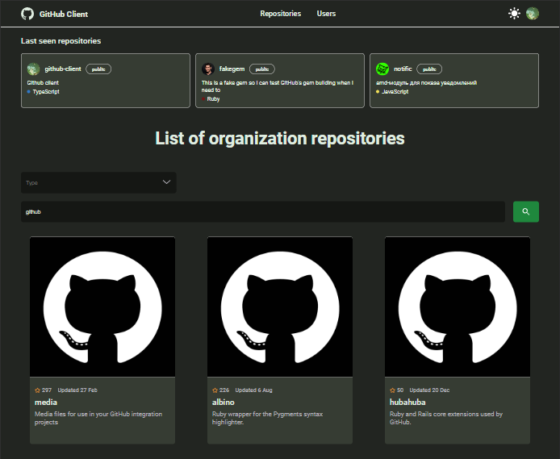

Потыкать можно -> ✨[здесь](https://vellun.github.io/github-client)✨ <-

- [Что реализовано](#что-реализовано)
  - [1. Поиск и фильтрация](#1-поиск-и-фильтрация)
  - [2. История просмотров](#2-история-просмотров)
  - [3. Аутентификация](#3-аутентификация)
  - [4. Страница профиля](#4-страница-профиля)
- [Локальный запуск](#запуск-проекта)
  - [1. Клонировать проект](#1-клонировать-проект)
  - [2. Перейти в директорию проекта](#2-перейти-в-директорию-проекта)
  - [3. Установить зависимости](#3-установить-зависимости)
  - [4. Запустить](#4-запустить)



## Что реализовано

### 1. Поиск и фильтрация:

- Поиск репозиториев и пользователей
- Фильтрация результатов по различным параметрам

### 2. История просмотров:

- Сохранение и отображение последних просмотренных репозиториев; реализовано через LocalStorage

### 3. Аутентификация

- Аутентификация через GitHub; реализовано через Firebase

### 4. Страница профиля:

- Отображение информации о пользователе и его репозиториях
- Возможность поиска и фильтрации по репозиториям пользователя

## Локальный запуск

### 1. Клонировать проект

```bash
git clone https://github.com/vellun/github-client
```

### 2. Перейти в директорию проекта

```bash
cd github-client
```

### 3. Установить зависимости

```bash
yarn install
```

### 4. Запустить

```bash
yarn start
```

По умолчанию приложение будет доступно на порту 3000

```bash
http://localhost:3000
```
